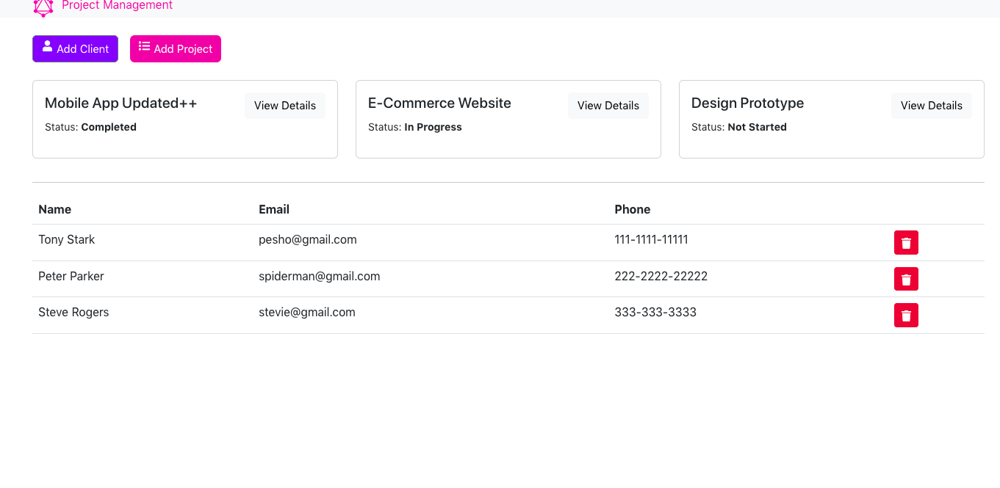
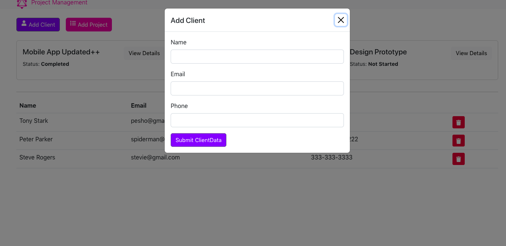
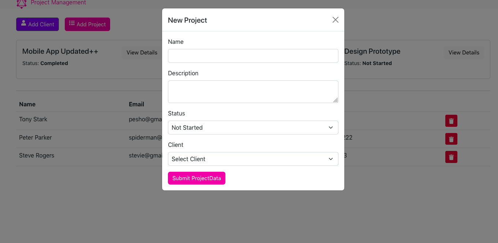
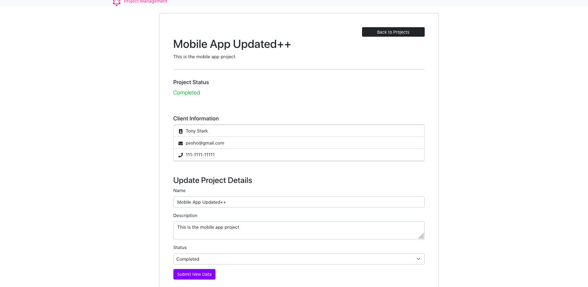

# Project Manager
Basic project management functionality allowing to add/delete/update new users and projects. Employing graphQL, express, mongoose on the back-end and react on the front-end.

Project mainly focusing on experimenting with Angular Animations as well as implementing more complex SCSS styles. Includes Bookmark Manager, Todo List and Note Reminder. With automatic re-render of background image.

--

### Main Page:

--

### Add Client Modal:

--

### Add Project Modal:

--

### Project Details:

---